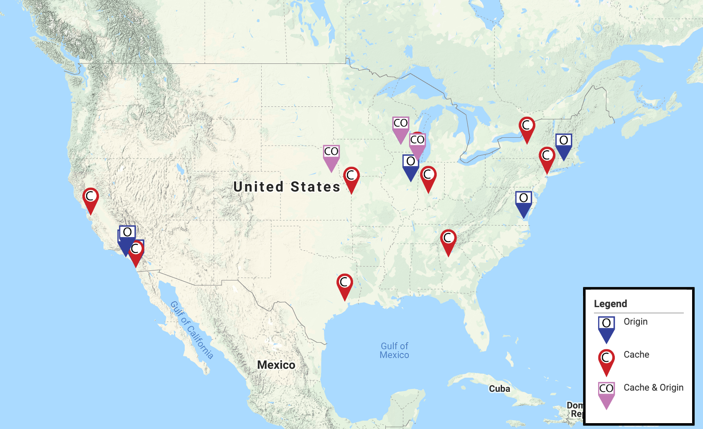

Open Science Data Federation Overview
========================

The OSG operates the _Open Science Data Federation_ (OSDF), which provides organizations with a method to distribute their data
in a scalable manner to thousands of jobs without needing to pre-stage data at each site.
The OSDF is best suited for per-job data set sizes between 1 and 50 GB,
with no more than 1 TB for a complete workflow.

Organizations export their data from an _origin server_,
and the data is streamed to jobs from a set of _cache servers_ distributed throughout the OSG and Internet2.
Jobs can achieve lower latency and higher throughput for data transfer by using a nearby cache
instead of accessing the origin directly.

The map below shows the location of the current caches in the federation:

## Architecture

The OSDF consists of three service types:

* **Origin**: Keeps the authoritative copy of an organization's data.
    Each origin is operated by the organization that wants to distribute its data within the federation.
* **Cache**: Transfers data to clients such as jobs or users.
    A set of caches are operated across the OSG for the benefit of nearby sites;
    in addition, each site may run its own cache in order to reduce the amount of data transferred over the WAN.
* **Redirector**: Tells a cache service which origin to download data from.
    The redirectors are run centrally by OSG Operations.

The structure of the federation is illustrated below:

A job will request data from a cache.
The cache will serve the requested data from local disk if possible.
Otherwise, it will query a redirector for the origin server that provides the data,
download the data from that origin server, and then serve the data to the job.
A copy of the data will be kept on the cache for use by future jobs.

## Joining and Using the OSDF

* Organizations can export their data to the OSDF by [installing the **Origin**](install-origin.md)
* Sites can reduce data transfer via the WAN by [installing the **Cache**](install-cache.md)
* Users can access OSDF via the
  [stashcp client](https://support.opensciencegrid.org/support/solutions/articles/12000002775-transferring-data-with-stashcach)
  or from CVMFS via the `/cvmfs/stash.osgstorage.org` directory tree.
