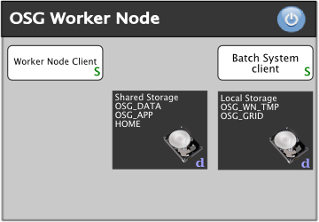
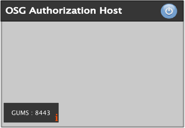
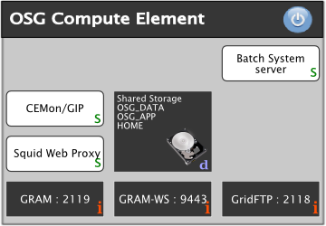
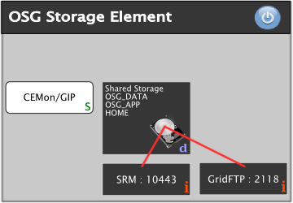

Site Planning
=============

!!! warning
    This documentation is outdated and some of the listed technologies are no longer in use:

    * GRAM and the Globus Gatekeeper have been removed in favor of HTCondor-CE
    * Managed Fork has been removed along with GRAM
    * GUMS and EDG-Mkgridmap are deprecated in favor of [LCMAPS-VOMS authentication](security/lcmaps-voms-authentication)
    * BeStMan is deprecated in favor of HDFS and load-balanced GridFTP
    * NFSLite has been removed

    Please be patient while we update the document to reflect current procedures and technologies.

## About this Document

This document is for **System Administrators**. The purpose of the document is to provide an overview about the different ways to setup an OSG site and to encourage you to plan your site before you continue to install the OSG software on your site.

After reading this document you should be able to identify the site elements needed to setup your OSG site and choose among different technology choices presented.

## Background

The goal for the Open Science Grid software stack is to provide a uniform computing and storage interface across many independently managed computing and storage clusters. Scientists, researchers, and students, organized as virtual organizations (VOs), are the consumers of the CPU cycles and storage.

Your site is encouraged to support as many OSG-registered VOs as possible, but you are not required to support all of them.

As the administrator responsible for deployment of the OSG software stack, your task is to make your existing computing and storage cluster available to and reliable for the VOs that you support. The OSG expects you to set up a gatekeeper node called a Compute Element (CE) on which the bulk of the OSG software gets installed. The end-user sends jobs into your cluster's batch system, your CE receives them and passes them out to Worker Nodes (WN) for execution. Some VOs and end-users require non-negligible amounts of data as input, or generate non-negligible amounts of data as output. They will need to store that data in a Storage Element (SE). A site is not required to provide both a CE and an SE.

## Site Policies

OSG expects you to clearly specify your site's policies regarding resource access. Please write them on a web page, make this page part of your site registration, and make it available via the GOC publishing tool [MyOSG](http://myosg.opensciencegrid.org) and the OSG information management system, OIM. We encourage you to allow all virtual organizations registered with the OSG at least "opportunistic use" of your resources. You may need to preempt those jobs when higher priority jobs come around. The end-users using the OSG generally prefer having access to your site subject to preemption over having no access at all.

## OSG Site Elements

The OSG provides software and documentation to install and operate following services:

| Element               | Description                                                                                |
|:----------------------|:-------------------------------------------------------------------------------------------|
| Authorization Service | enables grid users to authorize with your site using their grid or voms proxies            |
| Compute Element       | enables grid users to run jobs on your site                                                |
| Worker Node Client    | enables grid jobs running on worker nodes to access grid tools                             |
| Storage Element       | enables grid users to store large amounts of data at your site                             |
| VO Management Service | provides functionality for VO Managers to manage the membership information of their users |

### Authorization Service

Grid users will authorization with your site using their **grid or voms proxy**. The OSG provides two different services that let you control the authorization process:

| **Service**                     | **Description**                                                           | **Advantages**               | **Disadvantages**                          |
|---------------------------------|---------------------------------------------------------------------------|------------------------------|--------------------------------------------|
| edg-mkgridmap                   | a simple program that contacts VOMS servers and creates a gridmap file    | easy to install and maintain | does not support voms proxies              |
| [GUMS](security/install-gums)   | a web service providing sophisticated controls of how users authorization | supports voms proxies        | requires Tomcat to be run as a web service |

!!! warning
    A **VOMS Server** is not an element of your site. Each **Virtual Organization** operates a central VOMS Server to manage membership information of its grid users. Please contact the **VO Manager** for your virtual organization to obtain more details.

### Compute Element

A **Compute Element** allows grid users to run jobs on your site. It is software that provides following services when run on your **gatekeeper**: The standard installation is based on HTCondor-CE with RSV for monitoring.

You must determine your security policy with regard to Unix ID management on the cluster. You may choose group accounts and/or dynamic accounts for all users.

You must choose the OS (Red Hat Enterprise Linux derivative), the batch system (Condor, PBS, LSF, SGE, and Slurm are presently supported), and the network architecture of your cluster. The default network assumption is public/private with NAT so you will need to advertise your architecture by changing some settings by hand if yours isn't like this. In addition, there are some configuration choices, including one that avoids all NFS exports from the CE to the compute cluster (NFS-lite).

The CE hosts information provider(s) and monitoring services, most of which are configured correctly by default. We require all OSG sites to deploy Gratia, the OSG accounting system. Your site thus sends accounting records to OSG about jobs run on your site and data transfers involving your site. Aggregated summaries of this information can be viewed via the [GRACC](https://gracc.opensciencegrid.org).

<table>
<thead>
<tr class="header">
<th align="left">Service</th>
<th align="left">Description</th>
<th align="left">Comments</th>
</tr>
</thead>
<tbody>
<tr class="odd">
<td align="left">HTCondor-CE</td>
<td align="left">HTCondor-CE, based on the HTCondor batch system, provide a public entry point to your local batch system. 
It also allows grid users to <strong>fork</strong> jobs on your gatekeeper by default.</td>
<td align="left">Required</td>
</tr>
<tr class="even">
<td align="left">RSV</td>
<td align="left"><strong>R</strong>esource <strong>S</strong>ervice <strong>V</strong>alidation system which schedules execution of local &quot;probes&quot; of your CE (and SE), and reports the results up to the GOC. This is important for service availablity monitoring of OSG sites.</td>
<td align="left">Required</td>
</tr>
<tr class="odd">
<td align="left">Squid</td>
<td align="left">Squid is a caching proxy for the Web that enables restricted access of worker nodes to the web.</td>
<td align="left">Optional</td>
</tr>
<tr class="even">
<td align="left">Syslog-ng</td>
<td align="left">A logging service that can be used to forward CE logfiles to the GOC for troubleshooting purposes.</td>
<td align="left">Optional</td>
</tr>
</tbody>
</table>

Additionally two shared file systems are for grid users to install applications **OSG\_APP** (required) and to save data **OSG\_DATA** (optional). If available, both must be mounted on the gatekeeper and all worker nodes:

| Shared Filesystem | Description                                  | Recommended Size                 | Typical Size\[TB\] | Comments                                                                    |
|:------------------|:---------------------------------------------|:---------------------------------|:------------------:|:----------------------------------------------------------------------------|
| HOME              | space for grid user home directories         | 10GB for each VO                 |      0.1 to 1      | required, auto-cleanup                                                      |
| OSG\_APP          | space for grid users to install applications | 10GB for each VO                 |      0.1 to 1      | required, no auto-cleanup                                                   |
| OSG\_DATA         | space for grid users to stage data           | 10GB for each VO and worker node |      0.1 to 10     | optional, no quota, auto-cleanup                                            |
| OSG\_WN\_TMP      | tmp space for users on worker nodes          | 2GB for each cpu core            |         0.1        | required, auto-cleanup                                                      |
| OSG\_GRID         | location of the worker node client           | 10GB                             |         0.1        | optional/required (see %RED%NOTE%ENDCOLOR%) |

!!! note
    If you install wn-client on each node via RPM all the client software is available in the default path. There is no need for OSG\_GRID. The RPM installation creates `/etc/osg/wn-client/` with dummy setup files for compatibility with old jobs looking for a OSG\_GRID. New jobs should source the setup file in OSG\_GRID if this is defined; if not, they should expect all the client binaries in the default PATH.

### Worker Node Client

The [Worker Node Client](worker-node/install-wn) is software installed on each worker node to give programs running on the worker nodes access to grid utilities. While it is technically optional, it is **strongly recommended** that you install it on the gatekeeper and all worker nodes. This can be done as a local installation, in which the software is installed individually on every worker node, or as a shared installation in which the software is installed on one machine that shares it via a global file system to all the worker nodes. All the site configurations below are showing a local installation of the worker node client.

### Storage Element

A **Storage Element** provides grid users the possibility to read and write large amounts of data on your site using the **S**torage **R**esource **M**anager (**SRM**). All Storage Element implementations in the OSG support the gsiftp protocol and full or partial SRM specification. The selection of storage suitable for your site varies on anticipated usage patterns, available hardware, the choice of underlying distributed storage, support for a tape-archival backend etc.

There are two types of storage element services provided by OSG which implement SRM v2. See pointers to instructions for these services:

-   [BeStMan](data/bestman-overview) - Sits in front of any POSIX filesystem. There is also a version which supports xrootd filesystems.
-   [Hadoop](https://twiki.opensciencegrid.org/bin/view/Documentation/Release3/InstallHadoop200SE) - Map-reduce based solution to aggregate off-the-shelf disks into a scalable reliable system.

An SE must run correctly configured Grid Information Providers, Gratia accounting and RSV probes.

These services are supported by the OSG Storage group. Please email <osg-storage@opensciencegrid.org> for installation and support questions for these services.

| **Storage Requirements**                                                                     | **Min Hardware Requirements** | **OSG SE Solution**   |
|----------------------------------------------------------------------------------------------|-------------------------------|-----------------------|
| SRM interface, Dynamic Space Management Support                                              | Server with local disk        | BeStMan-fullmode      |
| SRM interface, No or Static Space Management Support                                         | Server with local disk or NFS | BeStMan-gateway       |
| SRM interface, No or Static Space Management Support, jobs need root protocol to access data | Multiple servers(&gt;3)       | BeStMan-gateway/Xrood |
| SRM interface, No or Static Space Management Support, file replication                       | Multiple servers(&gt;4)       | BeStMan-gateway/HDFS  |
| SRM interface, Dynamic Space Management Support, file replication, interface to tape backend | Multiple servers (&gt;5)      | dcache                |

### VO Management Service

A **V**irtual **O**ganization **M**anagement **S**ervice (VOMS) controls who is a member of your VO. Each VO needs to provide one VOMS. Please contact the VO Manager of VO to find out about the VOMS of your VO.

## Recommendations

In this section we outline %RED%important%ENDCOLOR% recommendations for setting up an OSG site. The recommendations are based on the knowledge of experienced system administrators and will help you avoid typical problems operating an OSG site from the beginning.

### Shared File Systems

We recommend to use a dedicated server for hosting the shared file system. The expected load on the file server could be distributed further by providing a dedicated file server for **HOME** and **OSG\_DATA** if possible. You should also consider to:

-   use a consistent mounting scheme for shared partitions when mounted on the gatekeeper with respect to all worker nodes
-   use a reasonable automatic cleanup procedure for **HOME**, **OSG\_DATA** and **OSG\_WN\_TMP**
-   not use an automatic cleanup procedures for **OSG\_APP**
-   not use quota for **OSG\_DATA**

#### NFS Warning

NFS is known to be an *easy* but less adequate for large sites. If you want to use NFS you should read the chapter *"Optimizing NFS Performance"* in the <http://nfs.sourceforge.net/nfs-howto/>. Software partitions that can be locally installed, such as OSG\_GRID, should be locally installed and not shared unless you have an enterprise-class NFS server.

### Compute and Storage Element

-   provide dedicated hardware for the Compute and the Storage Element
-   use as many cpu cores and main memory as possible
-   avoid running other grid services such as GUMS on the Compute and the Storage Element
-   avoid running a file server on the Compute and the Storage Element

### Use Job Manager managedfork instead of fork

*GRAM* provides several jobmanagers that control how jobs will be executed on the gatekeeper and the worker nodes. By %RED%default jobmanager fork%ENDCOLOR% will be used to allow grid users to run maintenance jobs on the gatekeeper. Unfortunately fork doesn't provide a way to restrict the number of jobs that may be run simultaneously.

By choosing %RED%managedfork instead of fork%ENDCOLOR% during the setup process, you will be able to restrict the number of simultaneous running jobs on the gatekeeper. We strongly recommend to choose managedfork as the default jobmanager when configuring the Compute Element.

### Role based Authentication using VOMS Proxies

*VOMS proxies* allow role based authentication. If your site will support VOMS proxies for authentication you will be able to restrict write access to shared file systems for grid users while providing write permissions to VO Administrators only. In this case we recommend to export **OSG\_APP** read-only to the gatekeeper and all worker nodes for grid users and read-write for VO Managers only.

## Example Configurations

This section contains a few example that illustrate how the different elements contributing to an OSG site can be combined. Each %GRAY%gray%ENDCOLOR% box represents a physical resource or virtual machine that is required in the example.

### OSG Resource with Compute Element

The image above shows all elements of a compute element. *edg-mkgridmap* is used to create the *grid-mapfile* and to keep it current. The *shared filesystem* is mounted on the compute element providing access to *OSG\_APP*, *OSG\_DATA* and *HOME*. *GRAM* and *GridFTP* use the *grid-mapfile* to authenticate requests to run jobs and to transfer data.

The image above shows a *Worker Node* that is connected to the *Compute Element* above by a network.  The *Worker Node Client* has to be installed on each worker node.  The *shared filesystem* is mounted on the worker node providing access to *OSG\_APP*, *OSG\_DATA* and *HOME*.  *Node Local Storage* is used for *OSG\_WN\_TMP* and *OSG\_GRID*. *OSG\_GRID* points to the installation of the *Worker Node Client*.

### OSG Resource with joined Compute and Storage Element

The left side shows elements of a joined Compute and Storage Element.  The shared file system is mounted on the compute and storage element. The *BeStMan* storage solution provides the *SRM Service* allowing grid users to remotely access the shared file system.

The image above shows a *Worker Node* that is connected to the *Compute Element* above by a network. The *Worker Node Client* has to be installed on each worker node. The *shared filesystem* is mounted on the worker node providing access to *OSG\_APP*, *OSG\_DATA* and *HOME*. *Node Local Storage* is used for *OSG\_WN\_TMP* and *OSG\_GRID*. *OSG\_GRID* points to the installation of the *Worker Node Client*.

### OSG Resource with separate Compute and Storage Element

The image above shows the elements of an authorization host. *GUMS* provides a central web service for grid authorization requests from storage and compute elements.  It is not required but recommended to run GUMS outside of the compute and and storage element which are shown below.

The image above shows all elements of a compute element. *GRAM* and *GridFTP* query *GUMS* to authenticate requests from grid users to run jobs or transfer data. The *shared filesystem* is mounted on the compute element providing access to *OSG\_APP*, *OSG\_DATA* and *HOME*.

The image above shows all elements of a storage element. *SRM* and *GridFTP* query *GUMS* to authenticate requests from grid users to transfer data. The *shared filesystem* is mounted on the compute element providing access to *OSG\_APP*, *OSG\_DATA* and *HOME*. The *BeStMan* storage solution provides the *SRM Service* allowing grid users to remotely access the shared file system.

The image above shows a *Worker Node* that is connected to the *Compute Element* above by a network. The *Worker Node Client* has to be installed on each worker node. The *shared filesystem* is mounted on the worker node providing access to *OSG\_APP*, *OSG\_DATA* and *HOME*. *Node Local Storage* is used for *OSG\_WN\_TMP* and *OSG\_GRID*. *OSG\_GRID* points to the installation of the *Worker Node Client*.

### OSG Resource with Compute Element and dCache Storage Element

*OSG Compute and dCache Storage Element using GUMS*

The left side shows all elements of a compute and a *dCache* storage element. On the right side a set of worker node are drawn which are distinct from *dCache Pool Nodes*. The worker nodes and dCache pool nodes are connected to the compute and storage element by a network. *GRAM* and *GridFTP* use *GUMS* to authenticate requests to run jobs and to transfer data.

